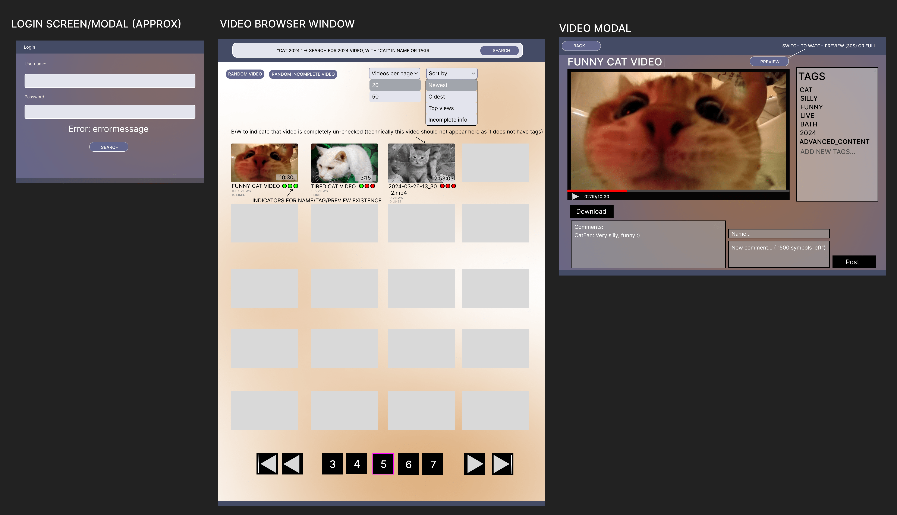
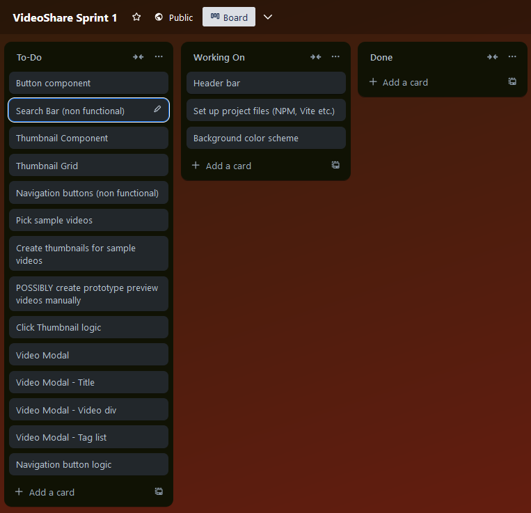
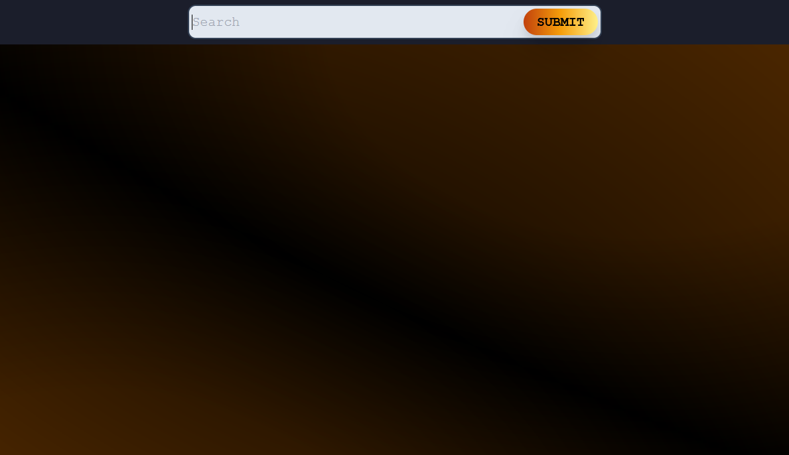
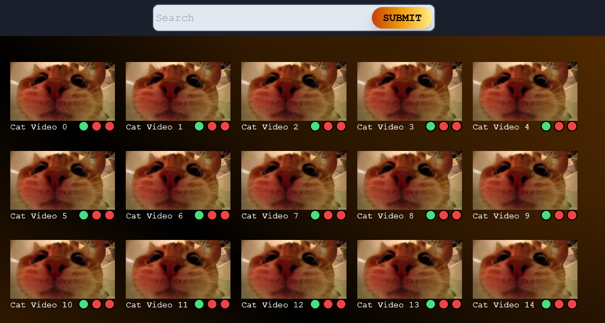

# Diary for production of the Front End for a video sharing platform

## Project goals and user stories

1) User can browse through a video catalogue hosted on a back end, and search for videos
2) User can rename and add tags to the videos for ease of search
3) User can log in - without logging in, possibly the website is not accessable
4) User can view a compilation of a video as a preview (30s long, generated at back end) to quickly check video content
5) User can view the complete video, and download it for personal use
6) User can view information about the video - length, size, view count, download count - to understand its content better
7) User can add a LIKE to video - requires multiple account setup, so NOT A FOCUS - to understand the quality of video
7) User can find a random video depending on few settings: Tagged/untagged, named/not named, preview generated/no preview yet
8) User can reorder the videos at their end by: length, views, upvotes...

Basically, a video streaming platform with download options. Users contribute to the naming/tagging of videos themselves, so 
that I do not have to do it myself. There will be a layer of security to even access the site but after that... as a 
self-hosted product for "fun", it is not a focus. I do not expect more than few people to use this.

## Basic info

### Working hours and production window

    - For the minimal viable product, few months should be enough

    - This includes research on how to create a functional Back End

    - Actual release of product for my own use has to wait for months - need more hard drives for back ups of videos

    - Working hours are not set in stone... for solid progress aim for HOURS Mon-Fri (no amount specified)

        - Other responsibilities hold me back somewhat

    - Scrum is not viable as I am a lone dev here... but its basic concepts can be utilized (concept of Sprint)

        - Assume now that a sprint is 1-2 weeks long, cannot really decide yet as situations change

        - In total, about 8 Sprints should be enough

### Roles

    - Just me... 

    - Possibly feedback from the possible users

### Logging of progress

    - First, create a product backlog (below, a table)

    - Second, create a prototype outlook of the site (Figma)

    - Thirdly, though I do not follow Scrum here (as a lone worker), utilize ""Sprint Goals/Sprint Backlog"" (Trello)

    - Fourthly (and so on)... every day I work on the product, write about the progress here (with images of Sprint Backlog/State of Product)

        - It would be the best, if some states of product are saved as branches! So, I SHOULD NOT delete all branches I might create when merging (easy way to back up)

### Chosen Technologies for Front End

    - Github for hosting, and naturally Git for management

    - Javascript (React framework) - May use Router in React

    - Styling with Tailwind (want to learn more)

### Chosen Technologies for Back End

    - Still rather open, so what is written here are guesses

    - Javascript(?), Express(?), FFMPEG(?), maybe Python based if there are problems

        - Especially when working with "preview video" generation... Can Javascript call FFMPEG?

    - Self-hosted, so no need for cloud services (Render etc.)

## Product Backlog

Items in this table are approximately in order of importance.
**Minimal Viable Product** ends at "Preview Videos" line

| Description        | Status      | Sprint | Comments/Parts                                                          |
|--------------------|-------------|--------|-------------------------------------------------------------------------|
| Main page          | Not started | 1      | Basic buttons, thumbnail grid, header                                   |
| Sample data base   | Not started | 1      | Pick videos, manually create preview/thumbnail                          |
| Logic to videos    | Not started | 1      | Clicking on thumbnail opens video Modal; buttons... basic for now!      |
| Navigation         | Not started |        | Videos/page... 20? 50?... loading new set?                              |
| Basic search       | Not started |        | Searchbar, logic of filter                                              |
| Info database      | Not started |        | Tags/Names/Likes(?)/Comments... data that cannot be obtained from video |
| Info input         | Not started |        | Input boxes when editing data related to a video                        |
| Refine work        | Not started |        | Connect previous parts and refine i.e. Advanced Search and tag click navigation                  |
| Display video info | Not started |        | Length, likes, view count                                               |
| Login logic        | Not started |        | Simple check if user has access to the site                             |
| Study Back End     | Not started |        | Begin creating a Back End solution for video/data hosting               |
| Connect Front/Back | Not started |        | Move data from Front End to Back, and connect                           |
| Preview videos     | Not started |        | Generate preview videos at Back End when necessary                      |
| Random video       | Not started |        | Basic, and optional settings (preview generated, etc.)                  |
| Comments           | Not started |        | Add ability to add comments to videos?                                  |
| Backup logic       | Not started |        | Create automatic backups of video info data periodically                |
| Ordering videos    | Not started |        | By length, likes, preview created... many ways!                         |
|                    |             |        |                                                                         |

## Visual Prototype

[See here for full image](./productVisualPrototype.png?ref_type=heads) 

## Diary

Write down progress report, any major problems and feelings toward the product

### 18.12.2024

- Produced this diary, repository, Product Backlog and basic visual prototype

- See above for the first visual prototype and Product Backlog

### 19.12.2024

- Began creating Sprint Backlog

- Decided to pick first four Product Backlog tasks for the sprint (Navigation as a special goal)

- Started work on the main page (set up Vite, Tailwind etc.)

    - Header bar, mockup of search bar and a submit button

    - Background color theme... not 100% happy but will do (want it to be dark)

- Add initial grid for thumbnails with title and status "lights"

    - Uses mock data, so a lot of work has to be done later

    - Mainly did this to test Flex

At the end of the day, "Main Page" task from the Product Backlog was marked as done ✅.

### 20.12.2024

- Begin working on Navigation buttons - basic functionality for test data

- To easily manage the page number, had to first create "Videos per page" multi-choice component!

    - Decided to make it a multipurpose one - reusable with "Sort by" later on

