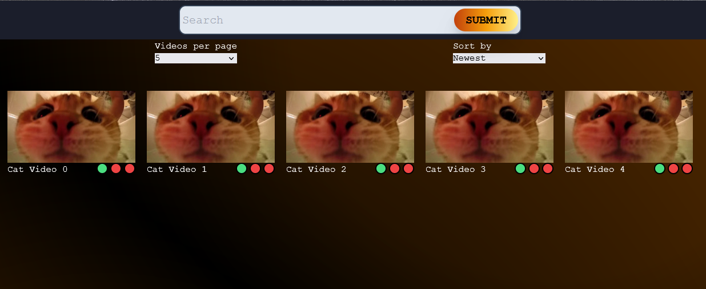

# Diary for production of the Front End for a video sharing platform

## Project goals and user stories

1) User can browse through a video catalogue hosted on a back end, and search for videos
2) User can rename and add tags to the videos for ease of search
3) User can log in - without logging in, possibly the website is not accessable
4) User can view a compilation of a video as a preview (30s long, generated at back end) to quickly check video content
5) User can view the complete video, and download it for personal use
6) User can view information about the video - length, size, view count, download count - to understand its content better
7) User can add a LIKE to video - requires multiple account setup, so NOT A FOCUS - to understand the quality of video
7) User can find a random video depending on few settings: Tagged/untagged, named/not named, preview generated/no preview yet
8) User can reorder the videos at their end by: length, views, upvotes...

Basically, a video streaming platform with download options. Users contribute to the naming/tagging of videos themselves, so 
that I do not have to do it myself. There will be a layer of security to even access the site but after that... as a 
self-hosted product for "fun", it is not a focus. I do not expect more than few people to use this.

## Basic info

### Working hours and production window

    - For the minimal viable product, few months should be enough

    - This includes research on how to create a functional Back End

    - Actual release of product for my own use has to wait for months - need more hard drives for back ups of videos

    - Working hours are not set in stone... for solid progress aim for HOURS Mon-Fri (no amount specified)

        - Other responsibilities hold me back somewhat

    - Scrum is not viable as I am a lone dev here... but its basic concepts can be utilized (concept of Sprint)

        - Assume now that a sprint is 1-2 weeks long, cannot really decide yet as situations change

        - In total, about 8 Sprints should be enough

### Roles

    - Just me... 

    - Possibly feedback from the possible users

### Logging of progress

    - First, create a product backlog (below, a table)

    - Second, create a prototype outlook of the site (Figma)

    - Thirdly, though I do not follow Scrum here (as a lone worker), utilize ""Sprint Goals/Sprint Backlog"" (Trello)

    - Fourthly (and so on)... every day I work on the product, write about the progress here (with images of Sprint Backlog/State of Product)

        - It would be the best, if some states of product are saved as branches! So, I SHOULD NOT delete all branches I might create when merging (easy way to back up)

### Chosen Technologies for Front End

    - Github for hosting, and naturally Git for management

    - Javascript (React framework) - May use Router in React

    - Styling with Tailwind (want to learn more)

### Chosen Technologies for Back End

    - Still rather open, so what is written here are guesses

    - Javascript(?), Express(?), FFMPEG(?), maybe Python based if there are problems

        - Especially when working with "preview video" generation... Can Javascript call FFMPEG?

    - Self-hosted, so no need for cloud services (Render etc.)

## Product Backlog

Items in this table are approximately in order of importance.
**Minimal Viable Product** ends at "Preview Videos" line

| Description        | Status      | Sprint | Comments/Parts                                                          |
|--------------------|-------------|--------|-------------------------------------------------------------------------|
| Main page          | Not started | 1      | Basic buttons, thumbnail grid, header                                   |
| Sample data base   | Not started | 1      | Pick videos, manually create preview/thumbnail                          |
| Logic to videos    | Not started | 1      | Clicking on thumbnail opens video Modal; buttons... basic for now!      |
| Navigation         | Not started |        | Videos/page... 20? 50?... loading new set?                              |
| Basic search       | Not started |        | Searchbar, logic of filter                                              |
| Info database      | Not started |        | Tags/Names/Likes(?)/Comments... data that cannot be obtained from video |
| Info input         | Not started |        | Input boxes when editing data related to a video                        |
| Refine work        | Not started |        | Connect previous parts and refine i.e. Advanced Search and tag click navigation                  |
| Display video info | Not started |        | Length, likes, view count                                               |
| Login logic        | Not started |        | Simple check if user has access to the site                             |
| Study Back End     | Not started |        | Begin creating a Back End solution for video/data hosting               |
| Connect Front/Back | Not started |        | Move data from Front End to Back, and connect                           |
| Preview videos     | Not started |        | Generate preview videos at Back End when necessary                      |
| Random video       | Not started |        | Basic, and optional settings (preview generated, etc.)                  |
| Comments           | Not started |        | Add ability to add comments to videos?                                  |
| Backup logic       | Not started |        | Create automatic backups of video info data periodically                |
| Ordering videos    | Not started |        | By length, likes, preview created... many ways!                         |
|                    |             |        |                                                                         |

## Visual Prototype

[See here for full image](./productVisualPrototype.png?ref_type=heads) 

## Diary

Write down progress report, any major problems and feelings toward the product

### 18.12.2024

- Produced this diary, repository, Product Backlog and basic visual prototype

- See above for the first visual prototype and Product Backlog

### 19.12.2024 - Start of \#1 Sprint

- Began creating Sprint Backlog

- Decided to pick first four Product Backlog tasks for the sprint (Navigation as a special goal)

- Started work on the main page (set up Vite, Tailwind etc.)

    - Header bar, mockup of search bar and a submit button

    - Background color theme... not 100% happy but will do (want it to be dark)

- Add initial grid for thumbnails with title and status "lights"

    - Uses mock data, so a lot of work has to be done later

    - Mainly did this to test Flex

At the end of the day, "Main Page" task from the Product Backlog was marked as done ✅.

### 20.12.2024

- Begin working on Navigation buttons - basic functionality for test data

- To easily manage the page number, had to first create "Videos per page" multi-choice component!

    - Decided to make it a multipurpose one - reusable with "Sort by" later on

- Had some minor problems related to the display of navigation buttons

    - IF we need buttons 1 - 5... everything OK!

    - But if we need more than that... have to limit it so, that we show for example: 3 4 5 6 7 (when on page 5)

- Managed to fix this, but it is not 100% ready. Good enough for now

- User can also move to a specific page through "..." buttons

- Added logic to navigation - which videos are shown

"Navigation" task from the Product Backlog was marked as done ✅.

- Started compiling actual sample data base (few videos)

    - Create thumbnails, preview videos etc.

    - Preview videos are excluded from the repo

- Managed to load the unique thumbnails from the public folder

    - OF COURSE this is NOT the actual way the app will work but need something to start testing video functionalities

- Next, tried to load the video into a [Video component](https://www.npmjs.com/package/react-player#supported-media)

- Seems to be working as expected

    - Include one sample video in .webm format, and end the day (rest will be created when Modal is done)

### 26.12.2024

Continued work after Christmas

    - Other responsibilities are also weighting down on the dev process

Decided to finish the first Sprint on this day

    - Components for the Video Modal (title, video div, tag list)

    - Also, thought about making the Video modal into a child (router)

    - Enables the user to obtain a shareable link to the video...

    - "Easy" to implement - change Modal to an Outlet

    - BUT! Remembering the previous search when returning... Session Storage or similar!

Modal is not scrollable, and the body behind modal scrolls... have to think about this

    - IF I stay with modals, have to make a scrollable modal (not immediate solution)

    - IF I change to router... have to deal with "Close" button logic

Added a Download button when the full video is shown

    - EASILY can add same functionality to preview but I believe it is not needed

    - Uses fetch, so... maybe usable in the end product?

THIS marks the spot where the first Sprint was completed!

### \#1 Sprint Review (18.12. - 26.12.2024)

What were the goals:

    - Get a working frame for the website

    - Add sample videos with a grid display of thumbnails

    - Ability to navigate if there are a lot of videos

    - Video Modal for display of single videos info (includes name, preview/full video, tag holder)

What was achieved:

    - All the goals were fullfilled in a manner that overall feel resembles the end product

    - The actual functionalities are "tests"...

What was left unfinished?

    - Some scaling problems when resolution is small

    - Full videos for other sample videos (NOT NECESSARY!)

    - Many of the functions are still "tests"

Were there any problems to be solved in the future?:

    - Currently data is held in "public" folder... NOT optimal, a lot of work to be done when "fetching" in the future
    
Should something in the plan be changed?:

    - VideoModal or Video Child (router)... have to think about this

    - Color scheme does not feel final

Next steps:

    - REALLY think about what is the upcoming JSON file format

        - What key-value pairs are necessary (date, length, tags...)

        - Read from file, currently it is generated in the code!

    - Info input

        - User can edit the title of the video and the tags - make changes in the JSON file!

    - Sample videos contain names and tags... COULD build the search functionality

    - Refine the current work

    - IF I have time, add video info (views, thumbs up statistic)

        - No functionality necessary yet!

### \#1 Sprint Retro (18.12. - 26.12.2024)

What went well:

    - I feel like, I really can build such a product by myself

    - On the first few days, a lot of progress was made "easily"

    - Diary and product progress tracking!

Is there something that still needs some adjustments:

    - Very easy to fall into the concept of "it just works" -> Need to understand and think about how the components NEED TO WORK when the own Back End is developed

    - Somethings are undecided, and maybe the "VideoModal" is a bad idea... rather than find solutions to Modal problems, should first decide if Router will be used!

Was something even harmful to the progress?:

    - Christmas... motivation loss due to it

    - Other responsibilities... cannot really talk about them here

    - Getting back on track! Possibly extend the length of the next Sprint if necessary (NOT REAL SCRUM MENTALITY!)

**After the review and retro!**

- Marked first sprint tasks as done both in Trello, and in the Product Backlog (main page Readme.md)

- Picked new tasks to the next Sprint

    - Basic Search, Info database, Info input, Refined work, Display video info(?)

- Will create the second Sprint Backlog tomorrow (and add link to the mainpage then)

### 27.12.2024 - Start of \#2 Sprint

OK! Woke up around 05:00 (military time)... Had to deal with a lot of paper work related to other life... projects

    - Basically had only time to build few ideas to the Sprint Backlog, but IT can evolve! So its fine

    - Sadly did not have time to really code today

Here's the  [Second Sprint Backlog](https://trello.com/b/vmm60EgD/videoshare-sprint-2)

### 2.1.2025

A quick update due to the holiday season - no progress has been made due to the Winter holidays and also other life situations

NAS/hosting/security solutions have been considered during this time

    - A NAS solution would cost at LEAST ~1000€ (~18Tb of data with RAID systems implemented)

    - Minimum investment at this point (depending on WHO hosts the files): ~400€ (without NAS)

    - Discussed security concepts with the product holders (people who will use the system)

    - Due to security concerns, and due to expected network usage...

    - We concluded that a VPN or some other 'limited' network solution is required

    - Increases security WITHOUT the need of log-in etc. in the Front End!

    - THIS actually helps the development! I do not have to spend time implementing EXTREMELY simple login system (a login that can be EASILY bypassed due to the lack of experience)

    - Hamachi and other such "free" solutions are considered and discussed on a later date

The product development IS NOT endangered... but consideration MUST be done before public release!

